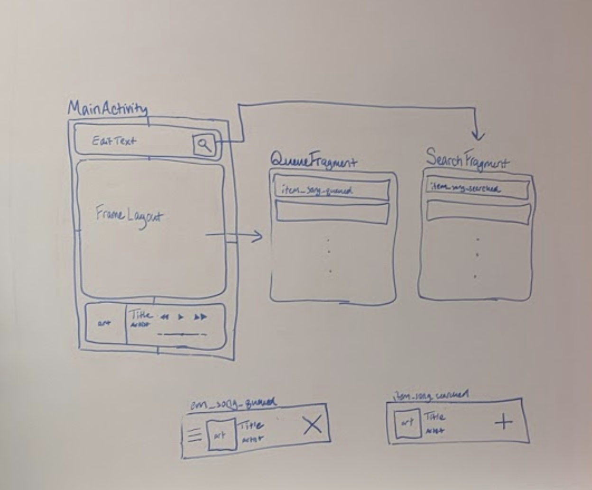

Group Project - README Template

Volunteering for Chumps (to be changed)

Table of Contents

1. Overview (https://hackmd.io/PjNl4T_PSzaDQ6LGA5tPuQ?both#Overview)
2. Product Spec (https://hackmd.io/PjNl4T_PSzaDQ6LGA5tPuQ?both#Product-Spec)
3. Wireframes (https://hackmd.io/PjNl4T_PSzaDQ6LGA5tPuQ?both#Wireframes)
4. Schema (https://hackmd.io/PjNl4T_PSzaDQ6LGA5tPuQ?both#Schema)

Overview

Description

Help people find and sign up for volunteering opportunities near them.   Maybe scrape a few volunteering services or find some APIs in order to get the event information.

App Evaluation

[Evaluation of your app across the following attributes]

* *Category:* Lifestyle
* *Mobile:* Use location to find nearby events, maybe integrate with calendar to find free time
* *Story: *People often want to volunteer in their free time, but it’s a lot of work to look for volunteering events.  This app would make it a lot easier for users to find volunteering opportunities, making it more likely that they will volunteer.  The app could also make it easier to see if any friends are volunteering at events near you  
* *Market: *Large market of high school kids who have mandatory volunteering hours.  
* *Habit: *Regular volunteers would come back to the app when they are looking for more events
* *Scope:* An MVP could simply leverage existing APIs or scrape existing sites to find volunteer events and offer them to the user. Further development could include functionality to sign up for events from the app, see what friends have signed up, and integrate calendar functionality to find free time to volunteer.

Product Spec

1. User Stories (Required and Optional)

*Required Must-have Stories*

* Search for a specific organization
* Search by time/location
* Results display relevant information
* Link to sign up
* Call information
* Seattle-focused
* See signed up events
* Categories for opportunities
* Basic profile info with edit functionality
* Log in with email and phone number

*Optional Nice-to-have Stories*

* Results display on map
* Add to calendar
* Sign up in app
* Add custom opportunity
* Find/see/search friends
* Recommended page
* Review organizations/events
* Push notifications
* Profile with statistics, completed activities
* Favorite events without signing up
* Un-sign up

2. Screen Archetypes

* Login
    * Log in with email and phone number
* Home Stream
    * See signed up events
    * Search for a specific organization
    * Search by time/location
* Results
    * Results display relevant information
* Profile
    * Basic profile info with edit functionality
* Details
    * Call information
    * Categories for opportunities
    * Link to sign up

3. Navigation

*Tab Navigation* (Tab to Screen)

* Profile
* Home Stream
* Search

*Flow Navigation* (Screen to Screen)

* Login
    * Home stream
* Home Stream
    * Detail
* Results
    * Detail
* Profile
    * None
* Details
    * None 
    * (opt. sign-up screen within app)

Wireframes

[BONUS] Digital Wireframes & Mockups

[BONUS] Interactive Prototype

Schema

[This section will be completed in Unit 9]

Models

[Add table of models]

Networking

* [Add list of network requests by screen ]
* [Create basic snippets for each Parse network request]
* [OPTIONAL: List endpoints if using existing API such as Yelp]

CaioDCosta
