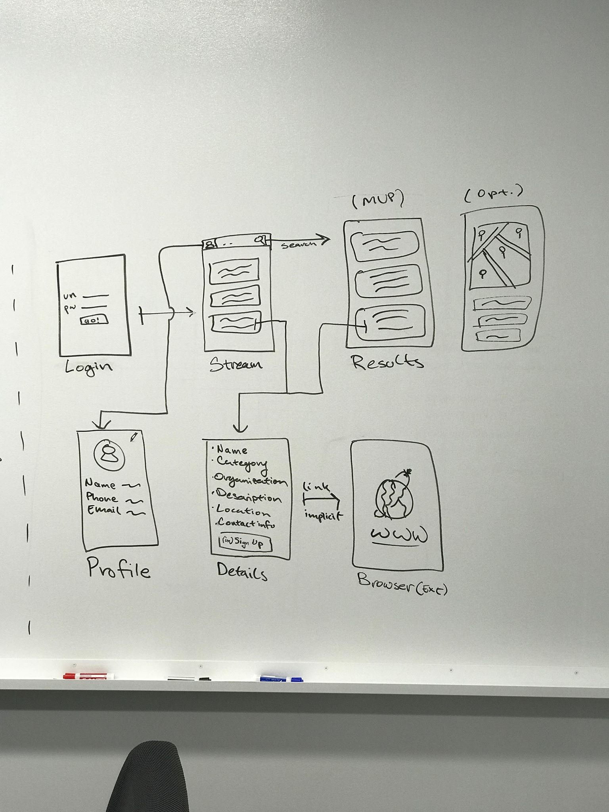

Group Project - README Template

**Title**

Table of Contents

1. Overview (https://hackmd.io/PjNl4T_PSzaDQ6LGA5tPuQ?both#Overview)
2. Product Spec (https://hackmd.io/PjNl4T_PSzaDQ6LGA5tPuQ?both#Product-Spec)
3. Wireframes (https://hackmd.io/PjNl4T_PSzaDQ6LGA5tPuQ?both#Wireframes)
4. Schema (https://hackmd.io/PjNl4T_PSzaDQ6LGA5tPuQ?both#Schema)

Overview

Description

App Evaluation

[Evaluation of your app across the following attributes]

* *Category:* 
* *Mobile:* 
* *Story: *
* *Market: *  
* *Habit: *
* *Scope:* 

Product Spec

1. User Stories (Required and Optional)

*Required Must-have Stories*

* 

*Optional Nice-to-have Stories*

* 

2. Screen Archetypes

* 

3. Navigation

*Tab Navigation* (Tab to Screen)

* 

*Flow Navigation* (Screen to Screen)

* 

Wireframes

[BONUS] Digital Wireframes & Mockups

[BONUS] Interactive Prototype

Schema

[This section will be completed in Unit 9]

Models

[Add table of models]

Networking

* [Add list of network requests by screen ]
* [Create basic snippets for each Parse network request]
* [OPTIONAL: List endpoints if using existing API such as Yelp]

CaioDCosta
